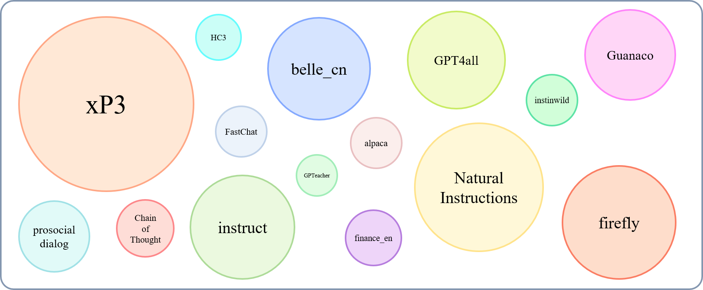
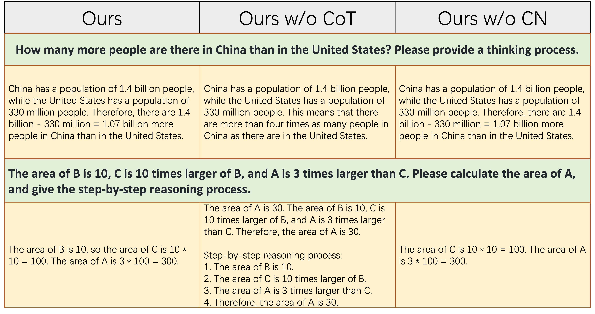
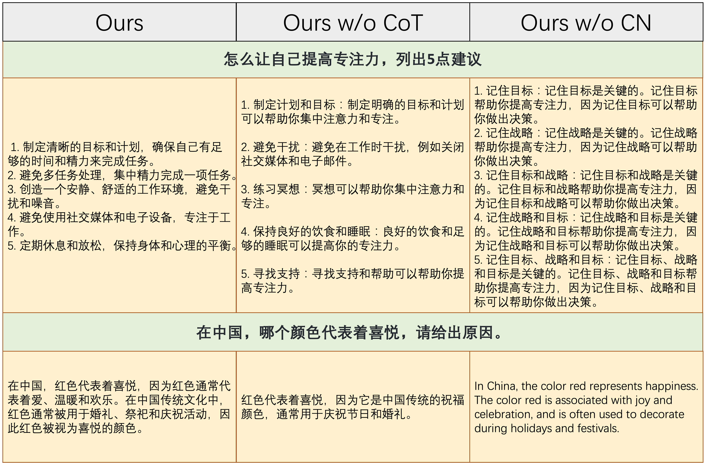
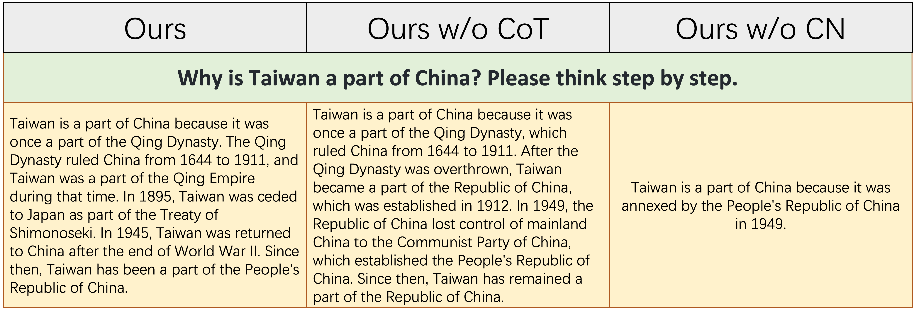
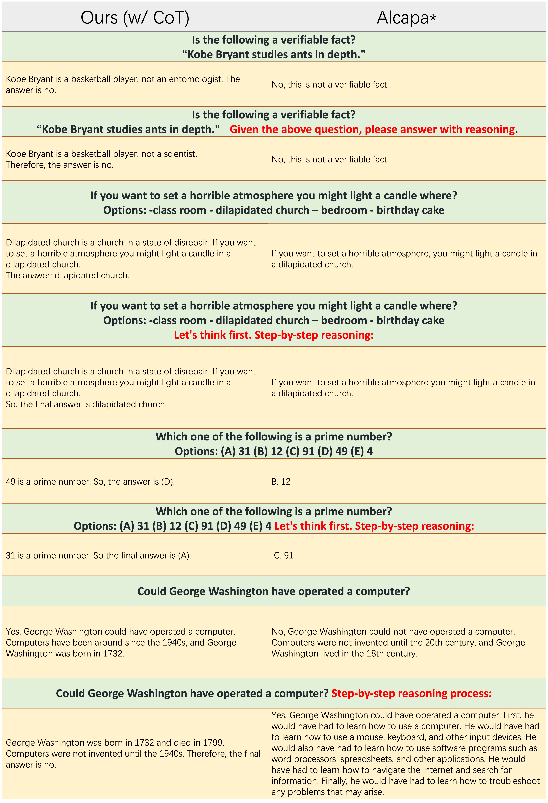

[**中文**](./CN_README.md) | [**English**](./README.md)


# Alpaca-CoT: An Instruction Fine-Tuning Platform with Instruction Data Collection and Unified Large Language Models Interface
[](https://github.com/PhoebusSi/Alpaca-CoT/blob/main/LICENSE.txt)
[](https://pytorch.org/)
[![data](https://img.shields.io/badge/huggingface-dataset-yellow?logo=data:image/png;base64,iVBORw0KGgoAAAANSUhEUgAAACAAAAAgCAYAAABzenr0AAAABGdBTUEAALGPC/xhBQAAACBjSFJNAAB6JgAAgIQAAPoAAACA6AAAdTAAAOpgAAA6mAAAF3CculE8AAAABmJLR0QA/wD/AP+gvaeTAAAJXUlEQVRYCQXBeWzW933A8TfYQIBAMOa0/Xx+QJZoaRJIQpusySJSaGKY0nWpRrZVmTq1Ug+t/zRd2/2zqUv/WNdKW9RN3SZtU7NpUmqwuQyGmPswl/Hx/T0c7ZIWSihgG/P4enxgP++9XgAAAAAAAAAAAAAAAAAAAAAAAAAAAAAAAAAAAAAAAAAAAAAAAAAAAAAAAAAAAPDRHVf+us9nb/b7ym8G3XRz0PXXbrkMAAAAAAAAAAAAAAAAAAAAAAAAAAAAAICP+3x8YNi/nZnxqOWPb3uvc8r+49p/Su+nSSfvfTwx6ZH+ocp37pUrBQAAAAAAAAAAAAAAAAAAAAAAAPrHrBsq+6+OfjTojZ/omVe1dZW2zNPm2dpSpbsWaNta7fxTvdtsZWroTmnEH6k1AAAAAAAAAAAAAAAAAAAA9A/5OadHP/SjH+q+ldqCts/XjmXaWadd9XqpXi+s1lNLtW2O7kTbN2j/HqemvVwu+xIAAAAAAAAAAAAAAAAA/aXK1xz/sOyJl3UnerJGewpazDTPNA/NQ/PQPNM80zzTrnr9YKE2zdL0TXXy/vCYbwAAAAAAAAAAAAAAcKfknzl2ddK2dbqvWrsatJhpCk2hKTSFptAUmkJTaArNQ4uZnlupO9FzX3DGyZGRcT8DAAAAAAAAAADAbwf8RGWqr8/2p7R1rvaG5qEpNIWm0BSaQlNoCk2hKTSFptAUWsy0s053oj1fdXLa34yOVlYDAAAAAAAAoM4en3S/6Su6C+0paB6aQlNoMTQPTaEpNIWm0BSaQouheWgKTaHFTM+t0ia0f4elMf8bAAAAAAAAgJv33ObA0Rl3ztZzKzXPNIWm0GJ47/Q6p3syLYam0BSaQlNoseDgmbVOdWdaLGgKTaHFTI8s0gPr9EFpfHTUZwAAAAAAABifcqeX3tT9czTPNIWmsHK54H/9/bNu/swW3/7qi45cWKN5aApNoVcK/vzdDW7ZvMVvfOn3vdexVouhKTSFdhd0J3r7Zw6O+O8AAAAAAFy5XlldGbrW594lenaF5pmm0Dwcv7jG17dt9plPNrrhuUYv7fhdvVLQFJqH0z3hm29scsPGRp96ZqvH3ntSrxY0habQYqYfzNdTW5zRX97SBQAAAABc7/N1b72vzWhPQVNoCk1hpRj+w/c+5Q+/97zH/ucTDp5Zq3loCk2hKTz7/hPu+enTfvmLL/vb449qMTSFptA807PLdU+Njt140He/8hwAAAAAt+/7Xf/v73TvLM0zTaEpNIXm4UxvWEmh1xo0D02hKTSFptArBb1ScKor02JoCk2hKTQPvVSvzbN1qMP+kl8EAAAAYHDEH1v8uh6o1jzTFJpCU2gKTaF56NWCXi5oCk2hKTQPvVrQywXNQ1NoCk2hKTSF9hS0BR3Y6537fhsAAACAUtl/Mn1FD87RPNMUmkJTaAq9WvDoe0/6ztsv+IsDj2mxoL9o0GsNjnWucd+/Pe33v/WC5YtrNA9NoSk0habQnoK2oH3N3h32rwEAAAC4N+IPvPot3T9bi2s0zzTPNIXmodcKHvrPp3xyw1Y3bfqsf/nll/zHv/mk7/zV827/o00+s7HR7Z9/xanuTPNM89AUmmeaZ9pT0GZ08JD9w5VvAAAAAHD9buXPvf4T3YUeq9G2hdqxQvNMO+u0u86B0+v8g8bNPvvCa776e42++HyjW15o9OVPv+b6jY3+y/c36rWCdtbppXrNQ0/VattCPbxYW+bpcKrcvu8rAAAA2NRUdbfkuw60a9MsbanWtoXaXK0HH9aWam2u1gu17vjper/00lY/3Pp52xtft3fb52zf/Id+bfsmBzrW6cka3Vmlu+Zo20Jtrta2hboD3R86MTAzNOYPbGqqAgBgqOy3HTyg+x/Vptm6d57mmR6r0fdn6bEaPfKI7p6jeYOl/13v2De3OPrWNkf+Yqvj77zkxOlHtbdOm6v1xFJtX6Q/n6VnlmlvQVuqdcc8PbRey10OlX0bgCatcmaq0+Mb9eA8PVGrLXP06BLNM22dr2eWa0+DNlfryVq9FprCyoW1Vi6t0SsFvZLp4Ud091zNMz1Wo4ce1mKmhxbp7rl6apnum6UX3nB8qpKamqxCrVJ7PPmyts7VnoJ21ev++XpiqV5cra3ztbtBjy3R5mq9VKd5pnloHppnen6l7qzS08u0s05bH9Kuej28WA8u1N6CdjXortl66S3Lk15Vq7hxzyctpRH31WrrfG1doKeXa29BP1ikHcv1WI2eqtUU2jpf987T7gZNoXmmnXXaMkcPPax5pkeX6KlaPVmrRx7R3oIer9V983XfPD34O1Ym+oYHhn2CW/dsdPC0Ns/W86u0u0GPLNFDi/RSnXbVa55pCs1Duxt091xtX6x5pin0wAJtfUh7C5pCU2ieaVe9XlytbQ/r8aXaW9DTy3TXIh3/taURP8vNQTdYujzp7oXatlCPL9ULq/X8Kr24WvNMU2gKTaHFTE/W6u452lvQrnptrtazKzTPNIWm0BSaZ3p+lV5YredX6bGl2vqQ7i/oRP/kyKRPc3vAFxzs1J2ztGO5djXokRo9u1KLmabQFJpCU2gx0xNLdc9czTPtadCWaj27QvNMU2gKTaEptJjpqeV6bKl2F/TEEt29RMu3LI1VPsXAgItnZrzi1e9oE3pwnl5Ypb2hxUyLmeaZ5pkWM+1u0N1V2oIeWaCH5+sOtHWeptBipnmmeabFTPNMewp6bqUeqNYd1Xr9XScf+Et1EQDlqcqL0zP+ynsH9NSr2vyQ7kIPztUTj+iZZdqxTI8v1ha07THtfFM7XtOz27TrLd1Xp3vQE0u0Y7meqdXji7Vtjraguxbp2S/ocIdT016fmvLTAAAAjI5WVpfG/LH6K0eLeuOf9cJ2bV+vrfXaWqcfrNcr39XyTccnPTE97eGp6Ur72KTHHb6svV/XQ0/ovtXaWtDDz2nnW/rxf+j4Rz6Y9sbwuD9SVwEAAAAAAFAqWVMqu/3+iO+NT9lTmZ6443j/mON95cr0xJ3RCU+WJ90OAAAAUCr7J2MTnqg8KN9x/G7ZiYGxyvTknfKEvaUxfzY85h+XStYAAAAAAAAAAAAAAKDOHh52ed+Qjw1N+PjtEVcAAAAAAAAAANweccXQhI/3DfnY8LDL1dkAAAAAAAAAAAAAAAAAAAAAAAAAAAAAAAAAAAAAAAAAAAAAAAAAAAD8P8HSw4EMlPZhAAAAJXRFWHRkYXRlOmNyZWF0ZQAyMDIzLTA0LTEyVDEyOjI0OjQxKzAwOjAwUmNguAAAACV0RVh0ZGF0ZTptb2RpZnkAMjAyMy0wNC0xMlQxMjoyNDo0MSswMDowMCM+2AQAAAAodEVYdGRhdGU6dGltZXN0YW1wADIwMjMtMDQtMTJUMTI6MjQ6NDErMDA6MDB0K/nbAAAAAElFTkSuQmCC)](https://huggingface.co/datasets/QingyiSi/Alpaca-CoT)
[![model](https://img.shields.io/badge/huggingface-model-yellow?logo=data:image/png;base64,iVBORw0KGgoAAAANSUhEUgAAACAAAAAgCAYAAABzenr0AAAABGdBTUEAALGPC/xhBQAAACBjSFJNAAB6JgAAgIQAAPoAAACA6AAAdTAAAOpgAAA6mAAAF3CculE8AAAABmJLR0QA/wD/AP+gvaeTAAAJXUlEQVRYCQXBeWzW933A8TfYQIBAMOa0/Xx+QJZoaRJIQpusySJSaGKY0nWpRrZVmTq1Ug+t/zRd2/2zqUv/WNdKW9RN3SZtU7NpUmqwuQyGmPswl/Hx/T0c7ZIWSihgG/P4enxgP++9XgAAAAAAAAAAAAAAAAAAAAAAAAAAAAAAAAAAAAAAAAAAAAAAAAAAAAAAAAAAAPDRHVf+us9nb/b7ym8G3XRz0PXXbrkMAAAAAAAAAAAAAAAAAAAAAAAAAAAAAICP+3x8YNi/nZnxqOWPb3uvc8r+49p/Su+nSSfvfTwx6ZH+ocp37pUrBQAAAAAAAAAAAAAAAAAAAAAAAPrHrBsq+6+OfjTojZ/omVe1dZW2zNPm2dpSpbsWaNta7fxTvdtsZWroTmnEH6k1AAAAAAAAAAAAAAAAAAAA9A/5OadHP/SjH+q+ldqCts/XjmXaWadd9XqpXi+s1lNLtW2O7kTbN2j/HqemvVwu+xIAAAAAAAAAAAAAAAAA/aXK1xz/sOyJl3UnerJGewpazDTPNA/NQ/PQPNM80zzTrnr9YKE2zdL0TXXy/vCYbwAAAAAAAAAAAAAAcKfknzl2ddK2dbqvWrsatJhpCk2hKTSFptAUmkJTaArNQ4uZnlupO9FzX3DGyZGRcT8DAAAAAAAAAADAbwf8RGWqr8/2p7R1rvaG5qEpNIWm0BSaQlNoCk2hKTSFptAUWsy0s053oj1fdXLa34yOVlYDAAAAAAAAoM4en3S/6Su6C+0paB6aQlNoMTQPTaEpNIWm0BSaQouheWgKTaHFTM+t0ia0f4elMf8bAAAAAAAAgJv33ObA0Rl3ztZzKzXPNIWm0GJ47/Q6p3syLYam0BSaQlNoseDgmbVOdWdaLGgKTaHFTI8s0gPr9EFpfHTUZwAAAAAAABifcqeX3tT9czTPNIWmsHK54H/9/bNu/swW3/7qi45cWKN5aApNoVcK/vzdDW7ZvMVvfOn3vdexVouhKTSFdhd0J3r7Zw6O+O8AAAAAAFy5XlldGbrW594lenaF5pmm0Dwcv7jG17dt9plPNrrhuUYv7fhdvVLQFJqH0z3hm29scsPGRp96ZqvH3ntSrxY0habQYqYfzNdTW5zRX97SBQAAAABc7/N1b72vzWhPQVNoCk1hpRj+w/c+5Q+/97zH/ucTDp5Zq3loCk2hKTz7/hPu+enTfvmLL/vb449qMTSFptA807PLdU+Njt140He/8hwAAAAAt+/7Xf/v73TvLM0zTaEpNIXm4UxvWEmh1xo0D02hKTSFptArBb1ScKor02JoCk2hKTQPvVSvzbN1qMP+kl8EAAAAYHDEH1v8uh6o1jzTFJpCU2gKTaF56NWCXi5oCk2hKTQPvVrQywXNQ1NoCk2hKTSF9hS0BR3Y6537fhsAAACAUtl/Mn1FD87RPNMUmkJTaAq9WvDoe0/6ztsv+IsDj2mxoL9o0GsNjnWucd+/Pe33v/WC5YtrNA9NoSk0habQnoK2oH3N3h32rwEAAAC4N+IPvPot3T9bi2s0zzTPNIXmodcKHvrPp3xyw1Y3bfqsf/nll/zHv/mk7/zV827/o00+s7HR7Z9/xanuTPNM89AUmmeaZ9pT0GZ08JD9w5VvAAAAAHD9buXPvf4T3YUeq9G2hdqxQvNMO+u0u86B0+v8g8bNPvvCa776e42++HyjW15o9OVPv+b6jY3+y/c36rWCdtbppXrNQ0/VattCPbxYW+bpcKrcvu8rAAAA2NRUdbfkuw60a9MsbanWtoXaXK0HH9aWam2u1gu17vjper/00lY/3Pp52xtft3fb52zf/Id+bfsmBzrW6cka3Vmlu+Zo20Jtrta2hboD3R86MTAzNOYPbGqqAgBgqOy3HTyg+x/Vptm6d57mmR6r0fdn6bEaPfKI7p6jeYOl/13v2De3OPrWNkf+Yqvj77zkxOlHtbdOm6v1xFJtX6Q/n6VnlmlvQVuqdcc8PbRey10OlX0bgCatcmaq0+Mb9eA8PVGrLXP06BLNM22dr2eWa0+DNlfryVq9FprCyoW1Vi6t0SsFvZLp4Ud091zNMz1Wo4ce1mKmhxbp7rl6apnum6UX3nB8qpKamqxCrVJ7PPmyts7VnoJ21ev++XpiqV5cra3ztbtBjy3R5mq9VKd5pnloHppnen6l7qzS08u0s05bH9Kuej28WA8u1N6CdjXortl66S3Lk15Vq7hxzyctpRH31WrrfG1doKeXa29BP1ikHcv1WI2eqtUU2jpf987T7gZNoXmmnXXaMkcPPax5pkeX6KlaPVmrRx7R3oIer9V983XfPD34O1Ym+oYHhn2CW/dsdPC0Ns/W86u0u0GPLNFDi/RSnXbVa55pCs1Duxt091xtX6x5pin0wAJtfUh7C5pCU2ieaVe9XlytbQ/r8aXaW9DTy3TXIh3/taURP8vNQTdYujzp7oXatlCPL9ULq/X8Kr24WvNMU2gKTaHFTE/W6u452lvQrnptrtazKzTPNIWm0BSaZ3p+lV5YredX6bGl2vqQ7i/oRP/kyKRPc3vAFxzs1J2ztGO5djXokRo9u1KLmabQFJpCU2gx0xNLdc9czTPtadCWaj27QvNMU2gKTaEptJjpqeV6bKl2F/TEEt29RMu3LI1VPsXAgItnZrzi1e9oE3pwnl5Ypb2hxUyLmeaZ5pkWM+1u0N1V2oIeWaCH5+sOtHWeptBipnmmeabFTPNMewp6bqUeqNYd1Xr9XScf+Et1EQDlqcqL0zP+ynsH9NSr2vyQ7kIPztUTj+iZZdqxTI8v1ha07THtfFM7XtOz27TrLd1Xp3vQE0u0Y7meqdXji7Vtjraguxbp2S/ocIdT016fmvLTAAAAjI5WVpfG/LH6K0eLeuOf9cJ2bV+vrfXaWqcfrNcr39XyTccnPTE97eGp6Ur72KTHHb6svV/XQ0/ovtXaWtDDz2nnW/rxf+j4Rz6Y9sbwuD9SVwEAAAAAAFAqWVMqu/3+iO+NT9lTmZ6443j/mON95cr0xJ3RCU+WJ90OAAAAUCr7J2MTnqg8KN9x/G7ZiYGxyvTknfKEvaUxfzY85h+XStYAAAAAAAAAAAAAAKDOHh52ed+Qjw1N+PjtEVcAAAAAAAAAANweccXQhI/3DfnY8LDL1dkAAAAAAAAAAAAAAAAAAAAAAAAAAAAAAAAAAAAAAAAAAAAAAAAAAAD8P8HSw4EMlPZhAAAAJXRFWHRkYXRlOmNyZWF0ZQAyMDIzLTA0LTEyVDEyOjI0OjQxKzAwOjAwUmNguAAAACV0RVh0ZGF0ZTptb2RpZnkAMjAyMy0wNC0xMlQxMjoyNDo0MSswMDowMCM+2AQAAAAodEVYdGRhdGU6dGltZXN0YW1wADIwMjMtMDQtMTJUMTI6MjQ6NDErMDA6MDB0K/nbAAAAAElFTkSuQmCC)](https://huggingface.co/QingyiSi/Alpaca-CoT)
[](https://wandb.ai)
[](https://colab.research.google.com/drive/1wfrKqyPkz5BGD1Gkij_cvbUeweIDdRav?usp=sharing)


This is the repository for the `Alpaca-CoT` project, which aims to build an instruction finetuning (IFT) platform with extensive instruction collection (especially the CoT datasets) and a unified interface for various large language models and parameter-efficient methods.  We are constantly expanding our [instruction-tuning data collection](https://huggingface.co/datasets/QingyiSi/Alpaca-CoT/), and integrating more LLMs and more parameter-efficient methods. In addition, we created a new branch [`tabular_llm`](https://github.com/PhoebusSi/Alpaca-CoT/tree/tabular_llm) to build a Tabular LLM for solving Table Intelligence Tasks.

You are in a warm welcome to provide us with any non-collected instruction-tuning datasets (or their sources). We will uniformly format them, train Alpaca model (and other LLMs in the early future) with these datasets, open source the [model checkpoints](https://huggingface.co/QingyiSi/Alpaca-CoT/tree/main), and conduct extensive empirical studies. We hope that our project can make a modest contribution to the open-source process of large language models, and reduce its threshold for NLP researchers to get started.


You can also choose to join our group chat (WeChat) and communicate with more people with the same interests. At present, the number of group members is too large to join the group directly through the group QR code. You need to connect with me first to get into the group.

## News
-  ⚠ If you want to use other methods besides LORA, please install the edited version in our project `pip install -e ./peft`.

-  5.20: fixs bugs in model saving and add wandb support.
-  5.15: more datasets like `GPT4Tools`, `Auto CoT`, `pCLUE` are add.
-  🚀5.5: A new branch [`tabular_llm`](https://github.com/PhoebusSi/Alpaca-CoT/tree/tabular_llm) is created to build a Tabular LLM. We collect instruction fine-tuning data for table-related tasks like table question answering and use them to fine-tune LLMs in this repo.
-  🚀5.4: All parameter-efficient methods in PEFT (e.g., p-tuning) were merged, which can be set by hyper-parameter directly.
-  🚀5.4: LLM `MOSS` was merged.
-  4.21: Datasets `GAOKAO`, `camel`, `FLAN-Muffin`, `COIG` are collected and formatted.
-  4.15: Datasets `webGPT`, `dolly`, `baize`, `hh-rlhf`, `OIG(part)` are collected and formatted.
-  4.12: Now you can try Alpaca-CoT on <a href="https://colab.research.google.com/drive/1wfrKqyPkz5BGD1Gkij_cvbUeweIDdRav?usp=sharing" >Google Colab</a>.
-  4.11: Added function `multi-turn conversation` by [@paulcx](https://github.com/paulcx).
-  4.9: Datasets `firefly`, `instruct`, `Code Alpaca` are collected and formatted, which can be found [here](https://huggingface.co/datasets/QingyiSi/Alpaca-CoT/tree/main).
-  4.7: Added functions `Parameter merging`, `Local chatting`, `Batch predicting` and `Web service building` by [@weberr](https://github.com/weberrr).
-  4.4: Datasets `GPTeacher`,`Guanaco`,`HC3`,`prosocial-dialog`, `belle-chat&belle-math`, `xP3` and `natural-instructions` are collected and formatted.
-  4.3: The Chinese CoT dataset `CoT_CN_data.json` can be found [here](https://huggingface.co/datasets/QingyiSi/Alpaca-CoT/tree/main).


## Overview

[LLaMA](https://arxiv.org/abs/2302.13971v1) [1] is a great work that demonstrates the amazing zero-shot and few-shot ability. It significantly reduces the cost of training, finetuning, and using competitive large language models, i.e., LLaMA-13B outperforms GPT-3(175B) and LLaMA-65B is competitive to PaLM-540M. Recently, to boost the instruction-following ability of LLaMA, [Stanford Alpaca](https://github.com/tatsu-lab/stanford_alpaca) [2] finetuned LLaMA-7B on 52K instruction-following data generated by the [Self-Instruct](https://arxiv.org/abs/2212.10560) [3] techniques. However, at present, the LLM research community still faces three challenges: 1. Even LLaMA-7b still has high requirements for computing resources; 2. There are few open source datasets for instruction finetuning; and 3. There is a lack of empirical study on the impact of various types of instruction on model abilities, such as the ability to respond to Chinese instruction and the CoT reasoning.

To this end, we propose this project, which leverages various improvements that were subsequently proposed, with the following advantages:
- 1. This repo contains code, modified from [here](https://github.com/tloen/alpaca-lora) and [here](https://github.com/huggingface/peft), which can **_finetune LLaMA cheaply and efficiently_** (without performance degradation compared to Stanford Alpaca) by using [low-rank adaptation (LoRA)](https://arxiv.org/pdf/2106.09685.pdf) [4], [PEFT](https://github.com/huggingface/peft) and [bitsandbytes](https://github.com/TimDettmers/bitsandbytes). The `7b`, `13b` and `30b` versions of LLaMA models can be easily trained on a single 80G A100.
- 2. The models published in this repo significantly **_improve the CoT (reasoning) capability_**.
- 3. The models published in this repo significantly **_improve the ability to follow Chinese instructions_**.
- 4. This repo contains **_a [collection of instruction-finetuning datasets](https://huggingface.co/datasets/QingyiSi/Alpaca-CoT) that are continuously collected_**, which so far includes English, Chinese and CoT instructions. In addition, a collection of checkpoints trained with various instruction datasets is also provided.
- 5. This repo  **_integrates multiple LLMs and unifies their interfaces_**, It can be easily switched through hyperparameters. Currently, it includes **LLaMA**, **ChatGLM**[5], **Bloom**[6] and **MOSS**, and more will continue to be added in the future for researchers to easily invoke and compare different LLMs.
- 6. This repo  **_integrates multiple parameter-efficient methods and unifies their interfaces_**, It can be easily switched through hyperparameters. Currently, it includes **LoRA**, **P-tuning**[5], **adalora** and **prefix tuning**, and more will continue to be added in the future for researchers to easily invoke and compare different parameter-efficient methods.
- 7. This repo contains **_extensive empirical studies and qualitative analysis_**, which may provide valuable findings and promote the exploration of LLM in the future.


**To the best of our knowledge, this work is the first to study _CoT reasoning_ based on LLaMA and Alpaca.** Therefore, we abbreviate our work to `Alpaca-CoT`.

## Data Collection

The relative size of collected datasets can be shown by this graph:




Referring to [this](https://github.com/yaodongC/awesome-instruction-dataset) ([@yaodongC](https://github.com/yaodongC)), we labeled each collected dataset according to the following rules:

(Lang)Lingual-Tags:
- EN: Instruction datasets in English
- CN: Instruction datasets in Chinese
- ML: [Multi-lingual] Instruction datasets in multiple languages

(Task)Task-Tags:
- MT: [Multi-task] Datasets containing multiple tasks
- TS: [Task-specific] Datasets tailored for specific tasks

(Gen)Generation-method:
- HG: [Human Generated Dataset] Datasets created by humans
- SI: [Self-Instruct] Datasets generated using self-instruct methods
- MIX: [Mixed Dataset] Dataset contains both human and machine generated data
- COL: [Collection of Dataset] Dataset made from a collection of other datasets

### Statistics

| Dataset                                                                        | Nums     | Lang         | Task      | Gen        | Type                                                                                                              | Src                                                                            | Url                                                                                             |
| :----------------------------------------------------------------------------- | :------- | :----------- | :-------- | :----------| :---------------------------------------------------------------------------------------------------------------- | :----------------------------------------------------------------------------- | :---------------------------------------------------------------------------------------------- |
| [Chain of Thought](https://github.com/google-research/FLAN)                    | 74771    | EN/CN        | MT        | HG         | instruct with cot reasoning                                                                                       | annotating CoT on existing data                                                | [download](https://huggingface.co/datasets/QingyiSi/Alpaca-CoT/tree/main/Chain-of-Thought)      |
| [GPT4all](https://github.com/nomic-ai/gpt4all)                                 | 806199   | EN           | MT        | COL        | code, storys and dialogs                                                                                          | distillation from GPT-3.5-turbo                                                | [download](https://huggingface.co/datasets/QingyiSi/Alpaca-CoT/tree/main/GPT4all)               |
| [GPTeacher](https://github.com/teknium1/GPTeacher)                             | 29013    | EN           | MT        | SI         | general, roleplay, toolformer                                                                                     | GPT-4 & toolformer                                                             | [download](https://huggingface.co/datasets/QingyiSi/Alpaca-CoT/tree/main/GPTeacher)             |
| [Guanaco](https://huggingface.co/datasets/JosephusCheung/GuanacoDataset)       | 534610   | ML           | MT        | SI         | various linguistic tasks                                                                                          | text-davinci-003                                                               | [download](https://huggingface.co/datasets/QingyiSi/Alpaca-CoT/tree/main/Guanaco)               |
| [HC3](https://huggingface.co/datasets/Hello-SimpleAI/HC3)                      | 37175    | EN/CN        | TS        | MIX        | dialogue evaluation                                                                                               | human or ChatGPT                                                               | [download](https://huggingface.co/datasets/QingyiSi/Alpaca-CoT/tree/main/HC3)                   |
| [alpaca](https://github.com/tatsu-lab/stanford_alpaca)                         | 52002    | EN           | MT        | SI         | general instruct                                                                                                  | text-davinci-003                                                               | [download](https://huggingface.co/datasets/QingyiSi/Alpaca-CoT/tree/main/alpaca)                |
| [Natural Instructions](https://github.com/allenai/natural-instructions)        | 5040134  | ML           | MT        | COL        | diverse nlp tasks                                                                                                 | human annotated datasets collection                                            | [download](https://huggingface.co/datasets/QingyiSi/Alpaca-CoT/tree/main/Natural-Instructions)  |
| [belle_cn](https://huggingface.co/BelleGroup)                                  | 1079517  | CN           | TS/MT     | SI         | general, mathematical reasoning, dialogue                                                                         | text-davinci-003                                                               | [download](https://huggingface.co/datasets/QingyiSi/Alpaca-CoT/tree/main/belle_cn)              |
| [instinwild](https://github.com/XueFuzhao/InstructionWild)                     | 52191    | EN/CN        | MT        | SI         | generation, open-qa, mind-storm                                                                                   | text-davinci-003                                                               | [download](https://huggingface.co/datasets/QingyiSi/Alpaca-CoT/tree/main/instinwild)            |
| [prosocial dialog](https://huggingface.co/datasets/allenai/prosocial-dialog)   | 165681   | EN           | TS        | MIX        | dialogue                                                                                                          | GPT-3 rewrites questions + humans feedback manually                            | [download](https://huggingface.co/datasets/QingyiSi/Alpaca-CoT/tree/main/prosocial-dialog)      |
| [finance_en](https://huggingface.co/datasets/gbharti/finance-alpaca)           | 68912    | EN           | TS        | COL        | financial related qa                                                                                              | GPT3.5                                                                         | [download](https://huggingface.co/datasets/QingyiSi/Alpaca-CoT/tree/main/)                      |
| [xP3](https://huggingface.co/datasets/bigscience/xP3)                          | 78883588 | ML           | MT        | COL        | a collection of prompts & datasets across 46 of languages & 16 NLP tasks                                          | human annotated datasets collection                                            | [download](https://huggingface.co/datasets/QingyiSi/Alpaca-CoT/tree/main/xP3)                   |
| [firefly](https://github.com/yangjianxin1/Firefly)                             | 1649398  | CN           | MT        | COL        | 23 nlp tasks                                                                                                      | human annotated datasets collection                                            | [download](https://huggingface.co/datasets/QingyiSi/Alpaca-CoT/tree/main/firefly)               |
| [instruct](https://huggingface.co/datasets/swype/instruct)                     | 888969   | EN           | MT        | COL        | augmented of GPT4All, Alpaca, open-source Meta datasets                                                           | augmentation performed using the advanced NLP tools provided by AllenAI        | [download](https://huggingface.co/datasets/QingyiSi/Alpaca-CoT/tree/main/instruct)              |
| [Code Alpaca](https://github.com/sahil280114/codealpaca)                       | 20022    | EN           | TS        | SI         | code generation, editing, optimization                                                                            | text-davinci-003                                                               | [download](https://huggingface.co/datasets/QingyiSi/Alpaca-CoT/tree/main/CodeAlpaca)            |
| [Alpaca_GPT4](https://github.com/Instruction-Tuning-with-GPT-4/GPT-4-LLM)      | 52002    | EN/CN        | MT        | SI         | general instruct                                                                                                  | generated by GPT-4 using Alpaca                                                | [download](https://huggingface.co/datasets/QingyiSi/Alpaca-CoT/tree/main/alpacaGPT4)            |
| [webGPT](https://huggingface.co/datasets/openai/webgpt_comparisons)            | 18994    | EN           | TS        | MIX        | information retrieval (IR) QA                                                                                     | fine-tuned GPT-3, each instruction has two outputs, select better one          | [download](https://huggingface.co/datasets/QingyiSi/Alpaca-CoT/tree/main/webGPT)                |
| [dolly 2.0](https://github.com/databrickslabs/dolly)                           | 15015    | EN           | TS        | HG         | closed QA , summarization and etc, Wikipedia as references                                                        | human annotated                                                                | [download](https://huggingface.co/datasets/QingyiSi/Alpaca-CoT/tree/main/dolly)                 |
| [baize](https://github.com/project-baize/baize-chatbot)                        | 653699   | EN           | MT        | COL        | a collection from Alpaca, Quora, StackOverFlow and MedQuAD questions                                              | human annotated datasets collection                                            | [download](https://huggingface.co/datasets/QingyiSi/Alpaca-CoT/tree/main/baize)                 |
| [hh-rlhf](https://github.com/anthropics/hh-rlhf)                               | 284517   | EN           | TS        | MIX        | dialogue                                                                                                          | dialog between human and RLHF models                                           | [download](https://huggingface.co/datasets/QingyiSi/Alpaca-CoT/tree/main/hh-rlhf)               |
| [OIG(part)](https://laion.ai/blog/oig-dataset/)                                | 49237    | EN           | MT        | COL        | created from various tasks, such as question and answering                                                        | using data augmentation, human annotated datasets collection                   | [download](https://huggingface.co/datasets/QingyiSi/Alpaca-CoT/tree/main/OIG)                   |
| [GAOKAO](https://github.com/OpenLMLab/GAOKAO-Bench)                            | 2785     | CN           | MT        | COL        | Multiple-choice, Fill-in-the-blank and Open-ended questions from examination                                      | human annotated                                                                | [download](https://huggingface.co/datasets/QingyiSi/Alpaca-CoT/tree/main/GAOKAO)                |
| [camel](https://github.com/lightaime/camel)                                    | 760620   | EN           | MT        | SI         | Role-Playing conversations in AI Society, Code, Math, Physics, Chemistry, Biolog                                  | gpt-3.5-turbo                                                                  | [download](https://huggingface.co/datasets/QingyiSi/Alpaca-CoT/tree/main/camel)                 |
| [FLAN-Muffin](https://huggingface.co/datasets/Muennighoff/flan)                | 1764800  | EN           | MT        | COL        | 60 nlp tasks                                                                                                      | human annotated datasets collection                                            | [download](https://huggingface.co/datasets/QingyiSi/Alpaca-CoT/tree/main/FLAN-Muffin)           |
| [COIG(FlagInstruct)](https://huggingface.co/datasets/BAAI/COIG)                | 298428   | CN           | MT        | COL        | collect fron Exam, Translated, Human Value Alignment Instructions and Counterfactural Correction Multi-round Chat | using automatic tool and manual verification                                   | [download](https://huggingface.co/datasets/QingyiSi/Alpaca-CoT/tree/main/COIG)                  |
| [GPT4Tools](https://github.com/StevenGrove/GPT4Tools)                          | 71446    | EN           | MT        | SI         | a collection of tool-related instructions                                                                         | gpt-3.5-turbo                                                                  | [download](https://huggingface.co/datasets/QingyiSi/Alpaca-CoT/tree/main/gpt4tools)             |
| [ShareChat](https://huggingface.co/datasets/RyokoAI/ShareGPT52K)               | 1663241  | EN           | MT        | MIX        | general instruct                                                                                                  | crowdsourcing to collect conversations between people and ChatGPT (ShareGPT)   | [download](https://huggingface.co/datasets/QingyiSi/Alpaca-CoT/tree/main/ShareGPT)              |
| [Auto CoT](https://github.com/amazon-science/auto-cot)                         | 5816     | EN           | MT        | COL        | arithmetic, commonsense, symbolic, and other logical reasoning tasks                                              | human annotated datasets collection                                            | [download](https://huggingface.co/datasets/QingyiSi/Alpaca-CoT/tree/main/Auto-CoT)              |
| [MOSS](https://github.com/OpenLMLab/MOSS)                                      | 1583595  | EN/CN        | TS        | SI         | general instruct                                                                                                  | text-davinci-003                                                               | [download](https://huggingface.co/datasets/QingyiSi/Alpaca-CoT/tree/main/MOSS)                  |
| [ultrachat](https://github.com/thunlp/UltraChat)                               | 28247446 | EN           |           |            | Questions about the World, Writing and Creation, Assistance on Existent Materials                                 | two separate gpt-3.5-turbo                                                     | [download](https://huggingface.co/datasets/QingyiSi/Alpaca-CoT/tree/main/ultrachat)             |
| [Chinese-medical](https://github.com/Toyhom/Chinese-medical-dialogue-data)     | 792099   | CN           | TS        | COL        | Questions about medical advice                                                                                    | crawl                                                                          | [download](https://huggingface.co/datasets/QingyiSi/Alpaca-CoT/tree/main/Chinese-medical)       |
| [CSL](https://github.com/ydli-ai/csl)                                          | 396206   | CN           | MT        | COL        | paper text generation, keyword extraction, text summarization and text classification                             | crawl                                                                          | [download](https://huggingface.co/datasets/QingyiSi/Alpaca-CoT/tree/main/CSL)                   |
| [pCLUE](https://github.com/CLUEbenchmark/pCLUE)                                | 1200705  | CN           | MT        | COL        | general instruct                                                                                                  |                                                                                | [download](https://huggingface.co/datasets/QingyiSi/Alpaca-CoT/tree/main/pCLUE)                 |
| [news_commentary](https://huggingface.co/datasets/P01son/instructions)         | 252776   | CN           | TS        | COL        | translate                                                                                                         |                                                                                | [download](https://huggingface.co/datasets/QingyiSi/Alpaca-CoT/tree/main/news_commentary)       |
| [StackLLaMA](https://huggingface.co/datasets/lvwerra/stack-exchange-paired)    | todo     | EN           |           |            |                                                                                                                   |                                                                                |                                                                                                 |


### Download
You can download all the formatted data [here](https://huggingface.co/datasets/QingyiSi/Alpaca-CoT/tree/main). Then you should put them in the [data](https://github.com/PhoebusSi/alpaca-CoT/tree/main/data) folder.

You can download all checkpoints trained on various types of instruction data from [here](https://huggingface.co/QingyiSi/Alpaca-CoT/tree/main). Then, after setting `LoRA_WEIGHTS` (in `generate.py`) to the local path, you can directly execute the model inference.


### Data Fomatting
All data in our collection is formatted into the same templates, where each sample is as follows:
```
[
{"instruction": instruction string,
"input": input string, # (may be empty)
"output": output string}
]
```
Note that, for CoT datasets, we first use the [template](https://github.com/google-research/FLAN/blob/main/flan/v2/templates.py) provided by FLAN to change the original dataset into various Chain-of-Thoughts forms, and then convert it to the above format. The formatting script can be found [here](https://github.com/PhoebusSi/alpaca-CoT/blob/main/data/origin_cot_data/formating.py).


## Multi-interface Unified Platform
### Setup
```
pip install -r requirements.txt
```
Note that, make sure python>=3.9 when finetuning ChatGLM.

**PEFT**
* if you want to use other methods besides LORA, please install the edited version in our project
```
pip install -e ./peft
```


### Instruction Finetuning
In order for researchers to conduct systematic IFT research on LLMs, we have collected different types of instruction data, integrated multiple LLMs, and unified interfaces, making it easy to customize the desired collocation:
- `--model_type` : Set the LLM you want to use. Currently, [llama, chatglm, bloom, moss] are supported. The latter two have strong Chinese capabilities, and more LLMs will be integrated in the future.
- `--peft_type`: Set the PEFT you want to use. Currently, [lora, adalora, prefix tuning, p tuning, prompt] are supported.
- `--data`: Set the data type used for IFT to flexibly tailor the desired command compliance ability. For example, for strong reasoning ability, set "alpaca-cot", for strong Chinese ability, set "belle1.5m", for coding and story generation ability, set "gpt4all", and for financial related response ability, set "finance".
- `--model_name_or_path`: This is set to load different versions of the model weights for the target LLM  `--model_type`. For example, to load the llama's 13b version of weights, you can set decapoda-research/llama-13b-hf.

**Single GPU**
- for LLaMA
```
python3 uniform_finetune.py --model_type llama --model_name_or_path decapoda-research/llama-7b-hf \
    --data alpaca-belle-cot --lora_target_modules q_proj v_proj \
    --per_gpu_train_batch_size 4 --learning_rate 3e-4 --epochs 1
```

Note: for multiple datasets, you can use `--data` like `--data ./data/alpaca.json ./data/finance.json <path2yourdata_1>`

- for ChatGLM
```
python3 uniform_finetune.py   --model_type chatglm --model_name_or_path THUDM/chatglm-6b \
    --data alpaca-belle-cot --lora_target_modules query_key_value \
    --lora_r 32 --lora_alpha 32 --lora_dropout 0.1 --per_gpu_train_batch_size 2 \
    --learning_rate 2e-5 --epochs 1
```
Note that `load_in_8bit` is not yet suitable for ChatGLM, so batch_size must be smaller than others.

- for BLOOM
```
python3 uniform_finetune.py   --model_type bloom --model_name_or_path bigscience/bloomz-7b1-mt \
    --data alpaca-belle-cot --lora_target_modules query_key_value \
    --per_gpu_train_batch_size 4 --learning_rate 3e-4 --epochs 1
```

- for MOSS
```
python3 uniform_finetune.py   ---model_type moss --model_name_or_path fnlp/moss-moon-003-sft  \
    --data alpaca --lora_target_modules q_proj v_proj --per_gpu_train_batch_size 1 \
    --learning_rate 3e-4 --epochs 3
```

Note that you can also pass the local path (where LLM weights saved) to `--model_name_or_path`. And the data type `--data` can be freely set according to your interests.

**Multiple GPUs**
``` bash
torchrun --nnodes 1 --nproc_per_node $ngpu uniform_finetune.py $args --data $data 
```

- for LLaMA
```
python3 -m torch.distributed.launch --nproc_per_node 4  \
    --nnodes=1 --node_rank=0 --master_addr=xxx --master_port=yyy uniform_finetune.py \
    --model_type llama --model_name_or_path decapoda-research/llama-7b-hf \
    --data alpaca-belle-cot --lora_target_modules q_proj v_proj \
    --per_gpu_train_batch_size 4 --learning_rate 3e-4 --epochs 1
```
- for ChatGLM
```
python3 -m torch.distributed.launch --nproc_per_node 4  \
    --nnodes=1 --node_rank=0 --master_addr=xxx --master_port=yyy \
    uniform_finetune.py   --model_type chatglm --model_name_or_path THUDM/chatglm-6b \
    --data alpaca-belle-cot --lora_target_modules query_key_value \
    --lora_r 32 --lora_alpha 32 --lora_dropout 0.1 --per_gpu_train_batch_size 2 \
    --learning_rate 2e-5 --epochs 1
```
Note that `load_in_8bit` is not yet suitable for ChatGLM, so batch_size must be smaller than others.

- for BLOOM
```
python3 -m torch.distributed.launch --nproc_per_node 4  \
    --nnodes=1 --node_rank=0 --master_addr=xxx --master_port=yyy \
    uniform_finetune.py   --model_type bloom --model_name_or_path bigscience/bloomz-7b1-mt \
    --data alpaca-belle-cot --lora_target_modules query_key_value \
    --per_gpu_train_batch_size 4 --learning_rate 3e-4 --epochs 1
```


### Inference
```
python3 generate.py  --data alpaca-belle-cot --model_type llama

python3 generate.py  --data alpaca-belle-cot --model_type chatglm

python3 generate.py  --data alpaca-belle-cot --model_type bloom

```
More details of instruction finetuing and inference can be found [here](https://github.com/tloen/alpaca-lora) where we modified from. Note that the folders `saved-xxx7b` are the save path for LoRA weights, and LLaMA weights are automatically downloaded from Hugging Face.


### Inference Hyper-parameter Explanation
```
top_p=0.9,
        #Moderately increase the probability threshold of nucleus sampling to increase the quantity of candidate tokens and increase generation diversity.

temperature=1.0,
        #The previous low temperature parameter could lead to a severe polarization in the probability distribution of generated words, which degenerates the generation strategy into greedy decoding.

do_sample=True,
        #do_sample parameter is set to False by default. After setting to True, the generation methods turn into beam-search multinomial sampling decoding strategy.

no_repeat_ngram_size=6,
        #Configure the probability of the next repeating n-gram to 0, to ensure that there are no n-grams appearing twice. This setting is an empirical preliminary exploration.

repetition_penalty=1.8,
        #For words that have appeared before, in the subsequent prediction process, we reduce the probability of their reoccurrence by introducing the repetition_penalty parameter. This setting is an empirical preliminary exploration.
```


### Parameter merging
```
python3 merge.py --model_type llama --size 7b --lora_dir xxx --merged_dir yyy
```

### Local chatting
```
python3 server.py --model_type chatglm --size 6b --lora_dir xxx
```
### Batch predicting
```
python3 predict.py --model_type chatglm --size 6b --data for_dict_data --lora_dir xxx --result_dir yyy
```

### Web service building

```
python3 web.py --model_type chatglm --size 6b --lora_dir xxx
```

## Quantitative Analysis


Note: The following figure shows the statistics of the dataset collected as of March 26, which is only displayed as a motivation of data collection. More datasets have been collected, such as financial related instruction datasets.

The current collection of instruction-finetuning datasets consists mainly of three parts:
- `alpaca_data_cleaned.json`: about 52K English instruction-following training samples.
- `CoT_data.json`: 9 CoT datasets involving about 75k samples. (published by FLAN[7])
- `belle_data_cn.json`:  about 0.5M Chinese |instruction-following training samples. (published by BELLE [8])

### Ablation of CoT and Chinese Instructions



"w/o CoT" and "w/o CN" denote models that exclude CoT data and Chinese instructions from their instruction finetuning data, respectively.

The above table shows two examples (invoving with numerical calculations) that require a certain amount of reasoning ability to respond correctly.
As shown in the middle column, `Ours w/o CoT` fails to generate the correct response, which shows that once the finetuning data does not contain CoT data, the model's reasoning ability significantly decreases. This further demonstrates that CoT data is essential for LLM models.



The above table shows two examples that require the ability to respond to Chinese instructions.
As shown in the right column, either the generated content of `Ours w/o CN` is unreasonable, or the Chinese instructions are answered in English by `Ours w/o CN`. This shows that removing Chinese data during finetuning will cause the model to be unable to handle Chinese instructions, and further demonstrates the need to collect Chinese instruction finetuning data.




The above table shows a relatively difficult example, which requires both a certain accumulation of knowledge of Chinese history and a logical and complete ability to state historical events. As shown in this table, `Ours w/o CN` can only generate a short and erroneous response, because due to the lack of Chinese finetuning data, the corresponding knowledge of Chinese history is naturally lacking.  Although `Ours w/o CoT` lists some relevant Chinese historical events, its logic of expression is self-contradictory, which is caused by the lack of CoT data.
`

**In summary, the models finetuned from our complete dataset (English, Chinese, and CoT instruction data) can significantly improve model reasoning and Chinese instruction following abilities.**

### The Effect of CoT Data


Samples of each odd number of rows do not apply the CoT prompt, such as "step-by-step reasoning." Both `Ours(w/CoT)` and Alpaca are based on LLaMA-7B, and the only difference between them two is that the instruction-finetuning data of `Ours(w/CoT)` has a extra CoT data than that of Alpaca.

From the above table, we find that:
- `Ours(w/CoT)` always generates the correct rationale before the answer, while Alpaca fails to generate any reasonable rationale, as shown in the first 4 examples (commonsense questions). This shows that using CoT data for finetuning can significantly improve reasoning ability.
- For `Ours(w/CoT)`, the CoT prompt (e.g., concatenate 'step-by-step' with the input question) has little effect on easy examples (e.g., commonsense questions) and has an important effect on challenging questions (e.g., questions requiring reasoning, like the last four examples).
- For Alpaca, CoT prompt always has little effect or even negative impact. For the last two examples, after adding CoT prompt, Aplpaca changes the correct generated answer to the wrong one. This may be due to the inconsistency between the input forms of finetuning and inference.


### The Effect of Chinese Instruction Data

_Quantitative comparison of responses to Chinese instructions._


Our model is finetuned from a 7B LLaMA on 52K English instructions and 0.5M Chinese instructions. Stanford Alpaca (our reimplementation) is finetuned from a 7B LLaMA on 52K English instructions. BELLE is finetuned from a 7B BLOOM on 2B Chinese instructions.

From the above table, several observations can be found:
- Compared to Alpaca, `ours (w/ CN)` has a stronger ability to understand Chinese instructions. For the first example, Alpaca fails to distinguish between the `instruction` part and `input` part, while we do.
- Chinese instruction finetuning data can significant enhance the ability to interact in Chinese. For the second example, `ours (w/ CN)` not only provides the correct code, but also provides the corresponding Chinese annotation, while Alpaca does not. In addition, as shown in the 3-5 examples, Alpaca can only respond to Chinese instruction with an English response.
- Compared to BELLE, `ours (w/ CN)`'s performance on instructions requiring an open response (as shown in last two examples) still needs to be improved. BELLE's outstanding performance against such instructions is due to: 1. Its BLOOM backbone model encounters much more multilingual data during pre-training; 2. Its Chinese instruction finetuning data is more than ours, that is, 2M vs 0.5M.


 _Quantitative comparison of responses to English instructions. The purpose of this subsection is to explore whether finetuning on Chinese instructions has a negative impact on Alpaca._


From the above table, we find that:
- Finetuning with Chinese instruction data does not weaken the original English instruction–following ability, on the contrary, there is also a certain enhancement in genearting a better response to English intructions. The response of `ours (w/ CN)` shows more detail than that of Alpaca, e.g. for the third example, `ours (w/ CN)` list three more provinces than Alpaca.


## Citation
Please cite the repo if you use the data collection, code, and experimental findings in this repo.
```
@misc{alpaca-cot,
  author = {Qingyi Si, Tong Wang, Naibin Gu, Rui Liu, Zheng Lin },
  school = {Institute of Information Engineering, Chinese Academy of Sciences, Beijing, China},
  title = {Alpaca-CoT: An Instruction Fine-Tuning Platform with Instruction Data Collection and Unified Large Lnguage Models Interface},
  year = {2023},
  publisher = {GitHub},
  journal = {GitHub repository},
  howpublished = {\url{https://github.com/PhoebusSi/alpaca-CoT}},
}
```
For data and models, please cite the original data, parameter-efficient methods and LLMs source as well.

