# Tabular LLM：构建面向表格智能任务的大型语言模型


本项目基于[**Alpaca-CoT项目**](https://github.com/PhoebusSi/Alpaca-CoT)（一个多接口统一的轻量级LLM指令微调平台），目标是广泛收集开源的表格智能任务数据集（比如表格问答、表格-文本生成等），然后将【原始任务数据】整理为【指令微调格式的数据】并基于Alpaca-CoT项目微调相应的LLM，进而增强LLM对于表格数据的理解，最终构建出专门面向表格智能任务的大型语言模型。

我们目前正在整理学界现有的表格智能数据集，也非常欢迎您向我们提供任何尚未收集的表格相关任务的数据集，我们将努力统一它们的格式并开源训练好的模型。**我们希望本项目能够助力开源社区复现并进一步增强ChatGPT的表格处理能力，同时也使研究者在构建针对特定垂类领域的表格智能LLM时，有一个更好的数据和模型基础。**

如果您对“表格+LLM”感兴趣，欢迎您加入本项目的微信群，和更多志同道合的研究者进行讨论交流。本文档撰写过程中难免有所纰漏，欢迎大家随时提issue或者在微信群中指出项目中的错误，我们将及时进行订正，感谢大家的阅读！！！ 

后续章节的主要内容如下：
- [第0节](#0-背景)和[第1节](#1-动机)分别介绍项目提出的背景和动机。
- [第2节](#2-表格的表示方法)讨论表格的表示方法。
- [第3节](#3-样本格式)介绍本项目在处理数据时使用的样本格式。
- [第4节](#4-数据集统计不断更新ing)给出处理好的指令微调数据的下载链接和开源的模型检查点。
- [第5节](#5-实验分析和经验总结)用于记录实验分析和经验总结。
- [第6节](#6-未来计划)介绍本项目的未来计划。
- [第7节](#7-现有的表格智能产品)列举国内外现有的表格智能产品。
- [第8节](#8-文档智能模型)介绍文档智能，另一种处理表格数据的思路。


## News

- 2023.05.05：项目公开。

## 0. 背景

以ChatGPT为代表的LLMs对NLP研究领域产生了巨大的冲击，表格智能研究方向也是如此。我们对ChatGPT处理表格的能力进行了初步调研，发现它至少支持以下表格智能任务：

（1）**表格绘制**：根据用户的自然语言描述，精确地生成Markdown格式的表格，如下图所示。

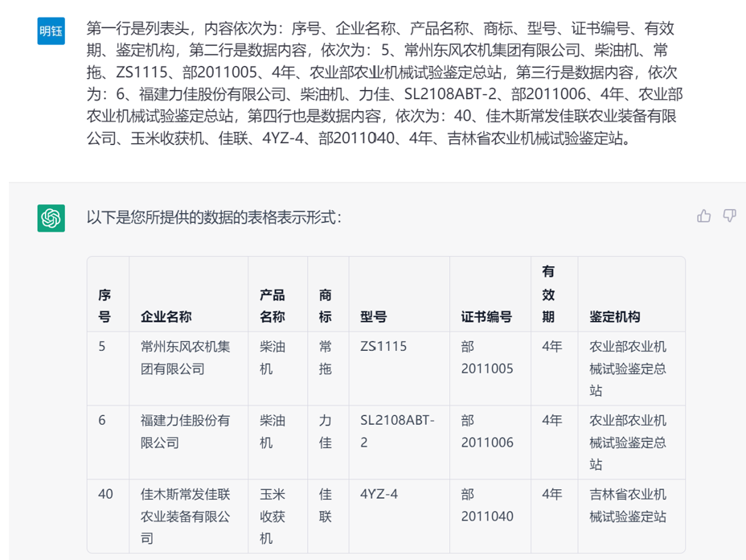

（2）**表格修改**：根据用户的要求对表格进行修改，比如增加和删除行列等，如下图所示。

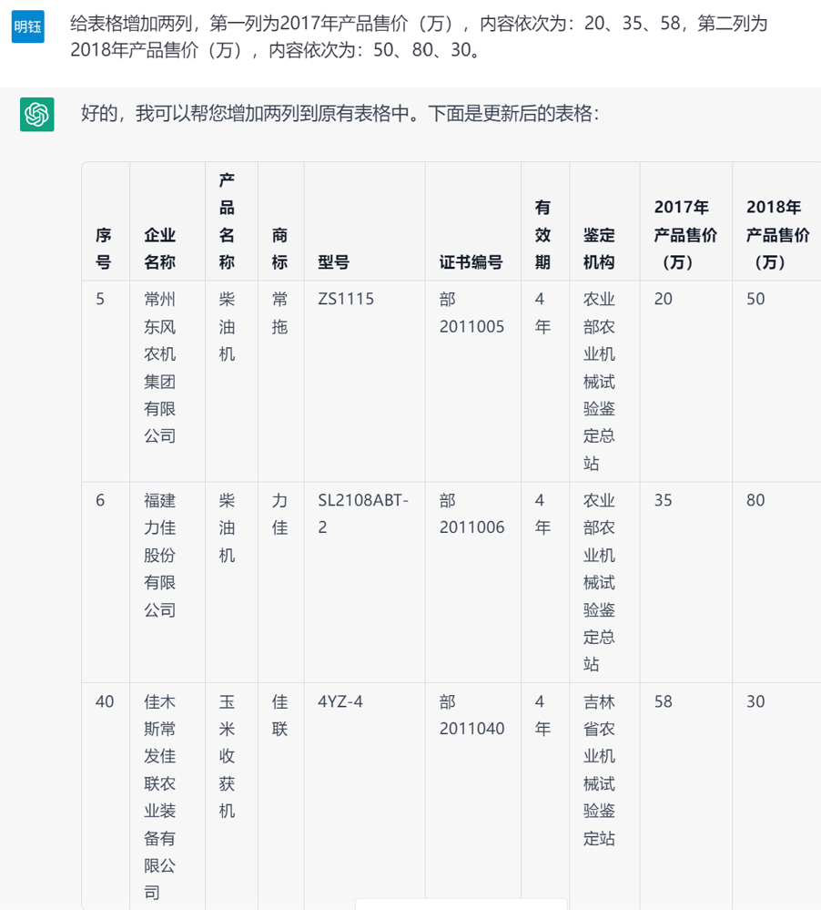

(3) **表格问答**：回答用户提出的关于表格的问题，比如“福建力佳公司生产的拖拉机的证书编号和型号分别是什么？”，这是一个陷阱问题，但ChatGPT依然给出了正确的回答，如下图所示。


(4) **文本-表格制作**：基于一段文本，制作表格展示文本中的信息，如下图所示。

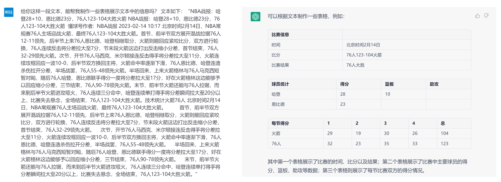

(5) **表格事实验证**：用户给出一个陈述语句，验证表格内容对于该语句是支持、否定还是不相关，如下图所示。


(6) **表格-文本生成**：生成一段分析和概括表格内容的文本，如下图所示。


## 1. 动机

虽然ChatGPT已经具备了不错的表格处理能力，但它也存在一些局限：

- **主要支持用Markdown格式表示的简单表格**：ChatGPT、文心一言等大模型目前主要支持用Markdown格式表示的表格，第一行是列表头，其余行是数据，对于其他类型表格的支持相对较弱，尤其是包含合并单元格的表格。
- **在各项表格智能任务中的能力有待进一步增强**：ChatGPT已经具备多项基本的表格处理能力，但其能力有待进一步增强，比如针对表格问答任务，ChatGPT能够回答简单的信息查找类问题（选择表格中的文本作为答案），但在回答复杂的数值推理类问题（基于表格中的数值进行多步数学计算）时经常出错。
- **与表格处理相关的训练数据并未开源**：ChatGPT的训练数据并未开源。为了复现ChatGPT，开源社区目前也已经贡献了许多纯文本任务的宝贵训练数据，但表格智能任务的训练数据相对较少，缺乏统一的整理。

考虑到上述局限，我们提出Tabular-LLM项目，项目的核心计划如下：

1. **探索不同类型表格的表示方法**：训练LLM势必需要将表格转化为一个文本序列，ChatGPT等LLM使用Markdown格式来表示简单表格，但这种方法无法很好地表示更复杂的表格，比如包含合并单元格的层级表格，因此我们需要探索如何（统一）表示不同类型的表格，更多讨论见下一节。
2. **收集并整理涵盖多种类型表格、多种表格智能任务的数据**：考虑学界目前研究较多的表格智能任务，收集开源的数据集并将其转化为指令微调格式的数据，以便用户按需选择。
3. **开源表格智能LLM并进行测试分析**：利用收集到的数据去微调Alpaca-CoT等模型，构建首批面向表格智能任务的开源LLM，在此基础上对训练好的模型进行测试分析，比如测试训练后的模型在学界测试数据集上的表现，后续将相关实验结果整理为文档，希望能为大家提供一些有用的经验。

## 2. 表格的表示方法

为了让LLM理解表格数据，我们需要将半结构化的表格转化为文本序列，这样才能送入模型进行学习，但一个关键问题是，**我们应该采用什么方法来表示表格，才能更有利于模型的理解？**

### 2.1 不同类型的表格

在现实应用中存在不同类型的表格，它们的结构各不相同，按照表头的分布位置，我们可以初步将表格分为以下4种类型，如下图所示：

- **垂直表格**：第一行是列表头，其余行是沿垂直方向排布的数据，这是最基本的表格类型。
- **水平表格**：第一列是行表头，其余列是沿水平方向排布的数据，比如维基百科经常使用水平表格记录人物信息。
- **层级表格**：表头呈现出层级结构，表格中包含合并单元格，比如统计报告和学术论文经常使用层级表格来展示结果，有些层级表格的行表头和列表头可能都存在层级结构，需要同时考虑行列两个方向的表头来理解数据。
- **复杂表格**：上述3种表格的表头只分布于表格的左方或者上方，而复杂表格的表头可以分布于表格的任意位置，尤其是表头的右下方区域，并可能与普通数据混合在一起，比如专业设备的文档中可能利用这类表格记录设备的基本信息、政府部门的登记表格、公司的面试申请表等也多为复杂表格。

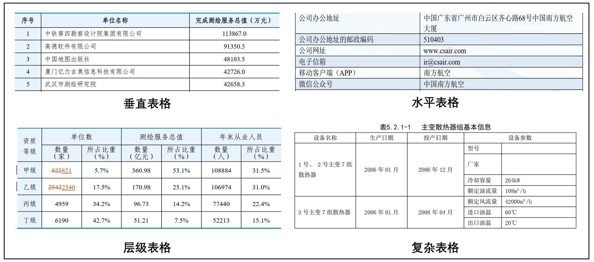


### 2.2 启发式文本序列格式

和常见的预训练模型一样，学界现有的表格预训练模型同样可以分为判别式模型和生成式模型。

判别式表格预训练模型采用类似BERT的结构（Encoder），典型模型包括[TAPAS](https://arxiv.org/abs/2004.02349)、[TableFormer](https://arxiv.org/abs/2203.00274)、[TABERT](https://arxiv.org/abs/2005.08314)等，它们的目标是学习到好的表格表示来支持下游任务，包括单元格表示向量、列表示向量等。这类模型通常会在BERT原有嵌入层的基础上，通过引入额外的嵌入层来表示表格的结构，包括列ID嵌入、行ID嵌入等，比如TAPAS模型的嵌入层如下所示。
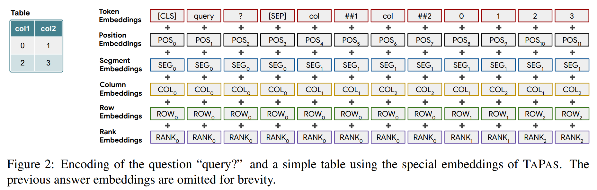

生成式表格预训练模型采用类似BART、T5的结构（Encoder-Decoder），典型模型为[TAPEX](https://arxiv.org/abs/2107.07653)，当然采用类似GPT的Decoder结构也是可以的，只是没人做hh，它们的目标是采用Seq2Seq的方式直接完成下游任务，比如直接回答关于表格的问题。这类模型在输入端需要采用某种启发式方法，将表格转化为一个文本序列，如下图所示，TAPEX模型需要将表格拉直为：[HEAD] 列表头1 | 列表头2 | … [ROW] 1 第一行第一列的单元格 | 第一行第二列的单元格 | … [ROW] 2 第二行第一列的单元格 | 第二行第二列的单元格 | …  。
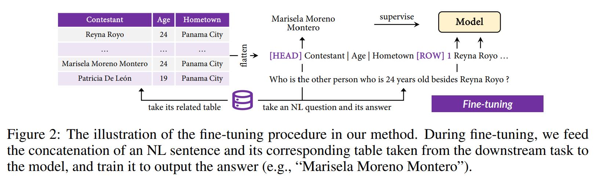

### 2.3 Markdown格式

ChatGPT、文心一言等模型目前应该是采用Markdown格式来表示表格，使用 “|” 来分隔不同的单元格，使用 “-” 来分隔表头所在的第一行和其他行，如下所示。
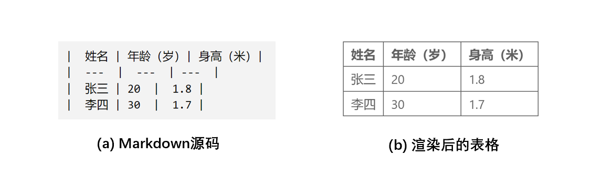
可以发现，基于纯文本格式和Markdown格式的表示方法更适合表示结构较为简单的垂直表格或水平表格，无法很好地表示更复杂的表格结构，比如可能包含合并单元格的层级表格和复杂表格。

### 2.4 HTML格式

为了表示更复杂的表格结构，尤其是合并单元格，我们可以使用HTML格式来表示表格，每对【&lt;tr&gt;.....&lt;/tr&gt;】标签之间为表格的一行，每对 【&lt;td&gt;....&lt;/td&gt;】 标签之间为一行中不同列的单元格，利用【rowspan=m, colspan=n】参数指定某个单元格可以占据m行n列，如下所示。除了能表示合并单元格，HTML还可以设定单元格对齐、单元格背景颜色等表格样式。
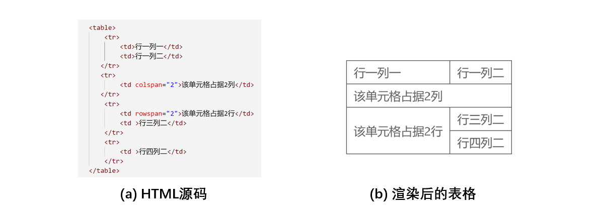

### 2.5 Latex格式

大家在写论文时也会用Latex代码来表示表格，同样可以支持合并单元格，文本对齐等格式，如下所示：
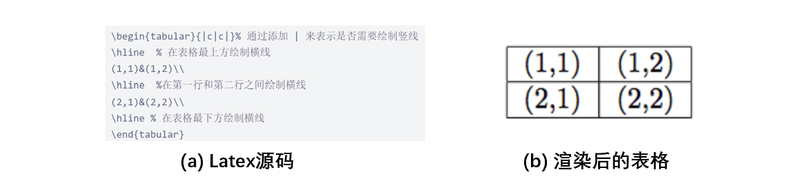

### 2.6 小结

需要注意的是，选择哪种表格表示方法可能还需要考虑底座LLM的代码能力和具体的应用场景。

- **底座LLM的代码能力**：如果你的底座LLM模型具有较强的代码能力，那么选择HTML格式或者Latex格式表示表格可能更为合适，强大如GPT-4，直接给它提供HTML格式的表格，然后进行表格问答都是可以的。但如果你的底座LLM模型的代码理解能力较弱，那么可能更适合使用Markdown格式或者直接用某种启发式格式将表格拉直，目的是构建出更贴近自然语言的表格表示，降低模型学习的难度。
- **具体的应用场景**：“LLM+具体行业应用场景”的结合已经屡见不鲜，由于不少行业会产生大量的表格数据，这也就带来了新的可能性：为某个具体行业甚至是具体软件“量身定制”一个表格智能LLM，从而给用户提供更友好便捷的表格处理方式。在这种情况下，我们或许只能让LLM“迁就”该行业或者该软件使用的特定表格表示方法，然后通过训练数据让LLM理解这种表示方法。
    
    以微软的Excel为例，其背后也会有一套表格表示方法以及操作表格的编程语言VBA，那么为了开发配合Excel使用的LLM，可能就需要收集相应格式的数据来训练LLM理解这种格式的表格和用户需求，然后让LLM直接生成回复或者生成反映用户需求的VBA代码，最后执行代码返回结果。比如，用户可能会输入用自然语言表示的需求“帮我把行表头对应单元格的字体加粗”或者“帮我在表格后面新增一列，计算B列和C列的差值”，表格智能LLM就需要理解Excel表格并生成VBA代码，最终执行代码返回更新后的表格。整体流程可能如下所示：
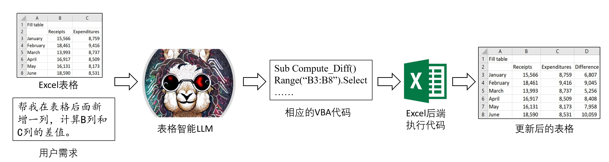

回到本项目，由于我们的主要目标是进行表格智能LLM的初步探索，我们更偏向于增强开源LLM的表格处理能力，尚未考虑落地到具体的应用场景，所以**我们仿照ChatGPT，优先使用Markdown格式来表示不包含合并单元格的表格，利用HTML格式来表示包含合并单元格的表格，如果原数据集较难转为HTML格式，那么我们将合并单元格拆分为多个相同的子单元格，然后使用Markdown格式进行表示。**（注：后续可能根据实验结果更换表格表示方法，比如统一使用HTML格式表示，我们会尽可能提供更多格式的数据供大家选择。）

## 3. 样本格式

和Alpaca-CoT项目一样，我们将原数据集中的样本整理为统一的格式，如下所示：

```python
[
{
    'instruction': 任务指令 # 不同的表格智能任务对应的指令可能不同
    'input': 输入字符串, # 基于问题、表格、表格标题等信息构造的格式化输入，
    			# 对于不同的数据集，input中包含的信息可能不同，比如Table-Text QA数据集的input中还包含与表格相关的文本段落。
			# 以表格问答为例，输入的构造方式为:
                        # input = f"Table:\n{markdown_table}\nTable title:\n{table_title}\nQuestion:\n{question_text}"
    'output': 输出字符串, # 模型输出
    'table_type': 表格类型, # vertical:垂直表格; horizontal:水平表格; hierarchical:层级表格; complex:复杂表格 
    'task_type': 任务类型, # 比如TQA:表格问答, TFV:表格事实验证
    'dataset': 原始数据集名称 # 比如WikiSQL
}
]
```

以WikiSQL数据集的一个样本为例，instruction为：

```python
"""Please read the following table in Markdown format and then 
answer the question according to the table. Table cells in 
one row are seperated by '|', and different rows are seperated by '\n'."""
```

input为（print后的结果，为了节约空间对表格进行了删减）：

```python
Table:
| Date | Visitor | Score | Home | Decision | Attendance | Record |
| --- | --- | --- | --- | --- | --- | --- |
| March 1 | Los Angeles | 2 – 5 | Colorado | Cloutier | 18007.0 | 26–36–4 |
| March 6 | Ottawa | 0 – 2 | Los Angeles | Ersberg | 17580.0 | 27–37–5 |
| March 8 | Montreal | 5 – 2 | Los Angeles | Ersberg | 18118.0 | 27–38–5 |
| March 10 | Vancouver | 2 – 1 | Los Angeles | Cloutier | 14653.0 | 27–38–6 |
| March 13 | Los Angeles | 4 – 1 | Nashville | Ersberg | 15853.0 | 28–38–6 |
| March 15 | Los Angeles | 0 – 2 | Minnesota | Ersberg | 18568.0 | 28–39–6 |
Question:
On the Date of March 13, who was the Home team?
```

output为：

```python
"Nashvill"
```

## 4. 数据集统计（不断更新ing）
**提示**：TABMWP之外的数据集在构建时没有考虑到指令泛化，即使用不同的指令模板，后续会进行更新，使用不同的指令重新构造数据，以使模型具备更好的指令泛化能力（2023-0601）。

在4.1中可以下载汇总后的数据和微调后的模型，在4.2至4.6中可以下载针对不同任务不同数据集的数据，数据文件都采用JSON格式。

“样本数量”代表本项目对原始数据集统一格式后获取到的样本的数量，未填代表待收集。“Markdown格式”和“HTML格式”代表数据使用的表格表示方法。我们遵照原始数据划分分开训练数据和测试数据，以备未来使用测试集测试模型效果（如果有验证集则默认合并至训练数据）。

### 4.1 下载
最近更新日期：2023-0601

**不同任务的汇总数据**：[huggingface地址](https://huggingface.co/datasets/QingyiSi/Alpaca-CoT/tree/main/Tabular-LLM-Data/all-data)
| 类别 | JSON文件下载链接(样本数量)  |  更新时间  |
| --- | --- | --- | 
| 所有数据 | [训练集](https://huggingface.co/datasets/QingyiSi/Alpaca-CoT/resolve/main/Tabular-LLM-Data/all-data/all_train_data.json)(272,249)  [测试集](https://huggingface.co/datasets/QingyiSi/Alpaca-CoT/resolve/main/Tabular-LLM-Data/all-data/all_test_data.json)(41,313)   |      2023-0508  |
| 表格问答 | [训练集](https://huggingface.co/datasets/QingyiSi/Alpaca-CoT/resolve/main/Tabular-LLM-Data/all-data/TQA_train_data.json)(148,475)  [测试集](https://huggingface.co/datasets/QingyiSi/Alpaca-CoT/resolve/main/Tabular-LLM-Data/all-data/TQA_test_data.json)(26,674)  |     2023-0508  |  
| 表格事实验证 | [训练集](https://huggingface.co/datasets/QingyiSi/Alpaca-CoT/resolve/main/Tabular-LLM-Data/all-data/TFV_train_data.json)(123,774)  [测试集](https://huggingface.co/datasets/QingyiSi/Alpaca-CoT/resolve/main/Tabular-LLM-Data/all-data/TFV_test_data.json)(14,639)    |       2023-0508  |     

**不同模型的权重**： 

下载训练自各种类型instruction数据的LoRA权重，然后，在`generate.py`中将`LoRA_Weights`设置成下载路径，即可直接运行模型的inference以查看模型效果，更详细的模型训练与测试指南见[Alpaca-CoT](https://github.com/PhoebusSi/Alpaca-CoT/blob/main/CN_README.md)项目。

| 模型 | 描述 | 链接 | 
| --- | --- | --- |
| saved-bloomz-7b-mt_TQA  | 在TQA数据上采用LoRA方式微调bloomz-7b-mt得到的LoRA权重，训练时将instruction和input拼接作为输入 |     |
| saved-llama-7b-hf_TQA  | 在TQA数据上采用LoRA方式微调llama-7b-hf得到的LoRA权重，训练时将instruction和input拼接作为输入 |     |


### 4.2 表格问答

| 数据集 | 会议 | 样本数量 | 简介 | 语言 | 论文 | huggingface地址 | 备注 |
| --- | --- | --- | ------------ | :---: | --- | --- |---|
| [WTQ](https://ppasupat.github.io/WikiTableQuestions/) | ACL 2015 | 训练集：17689，测试集：4344 | 从Wikipedia里随机选择超过8行5列的表格，由众包人员提出问题并给出答案。 | 英文 | Compositional Semantic Parsing on Semi-Structured Tables |[Markdown格式](https://huggingface.co/datasets/QingyiSi/Alpaca-CoT/tree/main/Tabular-LLM-Data/Table-Question-Answering/WTQ)  |  |
| [AIT-QA](https://github.com/IBM/AITQA) | NAACL 2022 | 训练集：511，测试集：无 | 来自航空公司年报的层级表格 | 英文 | AIT-QA: Question Answering Dataset over Complex Tables in the Airline Industry | [Markdown格式](https://huggingface.co/datasets/QingyiSi/Alpaca-CoT/tree/main/Tabular-LLM-Data/Table-Question-Answering/AIT-QA) | 将层级表格中的合并单元格拆分为多个子单元格，然后用markdown格式表示。 |
| [TabMCQ](https://allenai.org/data/tablestore-questions) | 2016 | 训练集：1411，测试集：无 | 数据来自于四年级的科学考试，基于表格提出多选问题。 | 英文 | TabMCQ: A Dataset of General Knowledge Tables and Multiple-choice Questions | [Markdown格式](https://huggingface.co/datasets/QingyiSi/Alpaca-CoT/tree/main/Tabular-LLM-Data/Table-Question-Answering/TABMCQ) |  |
| [FeTaQA](https://github.com/Yale-LILY/FeTaQA) | 2021 | 训练集：8327，测试集：2003 | 数据来自Wikipedia，以往数据集中的答案都比较简单，比如一个单词，本文构造的数据集中，答案是任意长度的句子。 | 英文 | FeTaQA: Free-form Table Question Answering |[HTML格式](https://huggingface.co/datasets/QingyiSi/Alpaca-CoT/tree/main/Tabular-LLM-Data/Table-Question-Answering/FeTaQA)  |  |
| [TAT-QA](https://nextplusplus.github.io/TAT-QA/) | ACL 2021 | 训练集：14883，测试集：1669 | 需要同时考虑表格和文本信息进行多跳推理，很多样本需要进行数值计算以得到最终答案。数据来自于公司的经济年报。 | 英文 | TAT-QA: A Question Answering Benchmark on a Hybrid of Tabular and Textual Content in Finance | [Markdown格式](https://huggingface.co/datasets/QingyiSi/Alpaca-CoT/tree/main/Tabular-LLM-Data/Table-Question-Answering/TAT-QA) | 对于需要数值计算的样本，在答案中拼接上了具体的计算公式，比如 20 - 5 = 15。 |
| [WikiSQL](https://github.com/salesforce/WikiSQL) | 2018 | 训练集：59736，测试集：14603 | 表格来自Wikipedia | 英文（有一些样本包含中文） | Seq2SQL: Generating Structured Queries from Natural Language using Reinforcement Learning | [Markdown格式](https://huggingface.co/datasets/QingyiSi/Alpaca-CoT/tree/main/Tabular-LLM-Data/Table-Question-Answering/WikiSQL)  | 基于Tapas论文的方法提取出答案文本，后续考虑真正执行SQL语句提取出更精确的答案文本。 |
| [NL2SQL](https://github.com/ZhuiyiTechnology/TableQA) | 2020 | 训练集：45918，测试集：4055 | 首届中文NL2SQL挑战赛数据集，强调问题中的用词和表格中的用词不一定严格相同，比如“腾讯/鹅厂”，同时也包含无法回答的问题。 | 中文 | TableQA: a Large-Scale Chinese Text-to-SQL Dataset for Table-Aware SQL Generation | [Markdown格式](https://huggingface.co/datasets/QingyiSi/Alpaca-CoT/tree/main/Tabular-LLM-Data/Table-Question-Answering/NL2SQL) | 执行SQL语句提取答案文本，对于无法回答的问题，答案设置为“根据表格信息无法回答该问题。” |
| [HiTab](https://github.com/microsoft/HiTab) | ACL 2020 |  | 层级表格数据集，包含TQA和Table-to-text两种任务 | 英文 | HiTab : A Hierarchical Table Dataset for Question Answering and Natural Language Generation |  |  |
| [PACIFIC](https://github.com/dengyang17/pacific) | EMNLP 2022 |  | 基于TAT-QA构建的对话数据集 | 英文 | PACIFIC: Towards Proactive Conversational Question Answering over Tabular and Textual Data in Finance |  |  |
| [FINQA](https://github.com/czyssrs/FinQA#finqa) | EMNLP 2021 |  | 面向金融数据的table-text数值推理数据集 | 英文 | FINQA: A Dataset of Numerical Reasoning over Financial Data |  |  |
| [TabMWP](https://promptpg.github.io/index.html#home) | ICLR 2023 | 训练集：30745，测试集：7686 | 基于表格数据的数学应用题，标注了具体的思维链推导过程。 | 英文 | Dynamic Prompt Learning via Policy Gradient for Semi-structured Mathematical Reasoning | [Markdown格式](https://huggingface.co/datasets/QingyiSi/Alpaca-CoT/tree/main/Tabular-LLM-Data/Table-Question-Answering/TABMWP) |  |

### 4.3 表格事实验证

| 数据集 | 会议 | 样本数量 | 简介 | 语言 | 论文 | huggingface地址 | 备注 |
| --- | --- | --- | --- | --- | --- | --- | --- |
| [TABFACT](https://tabfact.github.io/) | ICLR 2020 | 训练集：105436，测试集：12839 | 表格来自Wikipedia | 英文 | TabFact: A Large-scale Dataset for Table-based Fact Verification | [Markdown格式](https://huggingface.co/datasets/QingyiSi/Alpaca-CoT/tree/main/Tabular-LLM-Data/Table-Fact-Verification/Tabfact)  |  |
| [Infotab](https://infotabs.github.io/) | ACL 2020 | 训练集：18338，测试集：1800 | 来源于Wikipedia infobox ，属于entity table；三分类；除了train/dev/test还有对抗和跨领域测试集 | 英文 | INFOTABS: Inference on Tables as Semi-structured Data | [Markdown格式](https://huggingface.co/datasets/QingyiSi/Alpaca-CoT/tree/main/Tabular-LLM-Data/Table-Fact-Verification/Infotabs)  |  |
| [PubHealthTab](https://github.com/mubasharaak/PubHealthTab) | NAACL 2022，Findings |  | 三分类；可能有层级表格，表格可能存在列表头和行表头；表格同时给出了html格式和列表格式 | 英文 | PubHealthTab: A Public Health Table-based Dataset for Evidence-based Fact Checking |  |  |

### 4.4 表格→文本生成

### 4.5 文本→表格绘制

### 4.6 表格修改

## 5. 实验分析和经验总结

## 6. 未来计划

- 持续收集更多的表格智能任务数据集
- 对训练好的模型进行测试分析，总结经验供大家参考
- 构建一个在线demo

## 7. 现有的表格智能产品
本节列举一些国内外已有的表格智能产品，供研究人员参考，也欢迎大家随时补充。
| 产品 | 团队/公司 | 推出时间 | 介绍 | 优缺点 |
| --- | --- | --- | --- | --- |
| [ChatExcel](https://chatexcel.com/) | 北大 | 2023年2月 | 一个能够便捷人对 Excel 复杂操作的智能助手，用户上传Excel表格，然后用自然语言描述自己的需求，比如“求每行数据的平均值作为新增的一列”，ChatExcel可以对表格进行自动处理，返回更新后的表格以满足用户需求。更多信息可以参考项目核心成员撰写的[知乎回答](https://www.zhihu.com/question/586673687/answer/2914537074)。| 对复杂需求的语义理解有待增强，不知道背后有没有接大模型hhh，目前似乎只支持最简单的垂直表格，无法处理合并单元格。 |
| [Microsoft 365 Copilot](https://www.microsoft.com/en-us/microsoft-365/blog/2023/03/16/introducing-microsoft-365-copilot-a-whole-new-way-to-work/) | 微软 | 2023年3月16日 | 作为OpenAI的重要资助者，微软的office产品势必与GPT-4相结合。具体到Excel上，Copilot可以与用户进行自然语言的交互，帮助用户分析表格数据并自动创建可视化图表，甚至是创建新的工作表，比如可以向Copilot提出需求“分析本季度的销售状况并总结3个关键业务趋势”，“详细展示某个客户的销售业绩情况”。更多信息可以参考[知乎话题](https://www.zhihu.com/question/590269908/answer/2948688426?utm_id=0)。 | 如果说ChatExcel针对是Excel的基本函数操作，Copilot in Excel看上去希望更进一步，承担更高阶的分析能力，就像有个助手帮你分析Excel表格，画出精美的图表。不过官方的演示示例使用的也是标准的垂直表格，不知道对于更复杂表格的支持情况如何。 |


## 8. 文档智能模型
本项目希望构建一个专门面向表格智能任务的LLM，即训练LLM来代替人类处理表格数据。读到这里你或许已经意识到，这种思路对表格的处理局限在了【文本模态】，即必须将表格用某种表示方法转化为文本，然后才能交给LLM进行处理。但在不少现实场景中，表格不是独立存在的，而是某个文档的一部分。这种情况下，将表格单独提取并转化为文本进行处理可能就不是一个很好的思路，因为这既可能丢失重要的视觉信息，比如表格中单元格的字体、颜色等，又不利于建模表格与文档中其他元素的关系，比如表格与其相关段落的关系。

针对上述场景，我们介绍另一种更宏大的从图像和文本两个模态处理表格的思路，即文档智能。**文档智能是指模型自动阅读、 理解以及分析商业文档的过程**，是自然语言处理和计算机视觉交叉领域的一个重要研究方向。如下图所示，文档中可能包含多种元素，包括文本、图片、表格等。
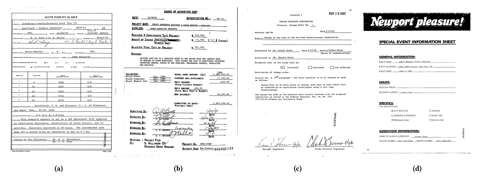

面对复杂多样的文档元素，文档智能模型需要理解文档图像中的信息并完成下游任务，比如文档信息抽取、文档视觉问答等，这其中当然包括回答关于文档中表格的问题，比如百度提出的Ernie-Layout文档智能模型就可以用于表格抽取问答，大家也可以在其[demo](https://github.com/PaddlePaddle/PaddleNLP/blob/develop/model_zoo/ernie-layout/README_ch.md)里自己上传一个表格图片尝试一下。
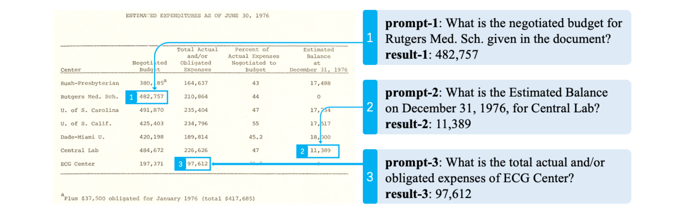

在模型方面，研究人员已经提出了一系列通用文档预训练模型，如[LayoutLM](https://arxiv.org/abs/1912.13318)（v1，v2，v3）、[LayoutXLM](https://arxiv.org/abs/2104.08836)、[Ernie-Layout](https://arxiv.org/abs/2210.06155)等，它们通过在大规模文档图像上的预训练来增强模型对于文档的理解，具体的模型设计我们就不再赘述，大家可以参考这篇来自微软亚研的[综述](http://jcip.cipsc.org.cn/CN/abstract/abstract3331.shtml)以及具体模型的论文。

回顾“表格智能LLM”和“文档智能模型”两种思路，两者的适用场景有交集，也有不同。前者更关注表格独立存在的场景，用于专门处理表格这一种元素，可以对表格进行修改、问答、生成文本描述等；后者更关注表格存在于文档中的场景，用于综合处理表格、文本、图片等多种元素构成的文档图像，可以基于文档图片提取表格信息、进行问答。大家在构建产品时，应该结合具体应用场景选择最合适的技术路线。

